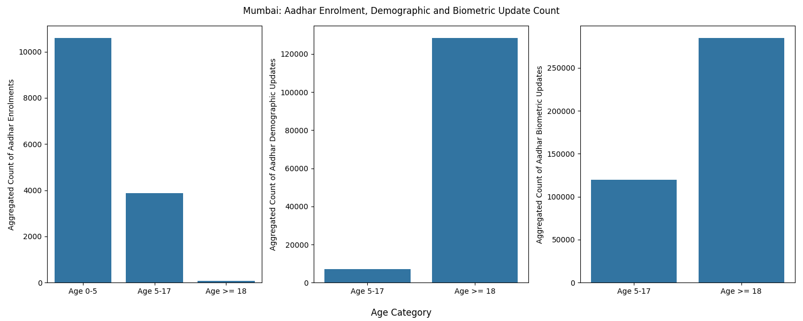

# Strategic Framework for Predictive Talent Mapping and Event Optimization

<p align="center">
  
  
  
</p>
<p align="center">
  
  
  
  
</p>

> A data-driven framework for optimizing government hackathon locations using Aadhaar transactional analytics, college distribution, startup ecosystems, and industrial presence across India.

---

## Problem Statement

National upskilling initiatives and hackathons often lack data-driven insights for optimal planning and location selection. Traditional approaches fail to:

- Accurately identify where youth populations are most active
- Align events with regional industrial strengths
- Connect upskilling programs with local startup ecosystems
- Minimize participant travel burden and maximize accessibility

This results in **inefficient resource allocation** and **missed opportunities** to engage youth with industry professionals.

---

## The Hypothesis: Youth Population Index (YPI)

### The Core Insight

Instead of relying on static census data, we leverage **high-frequency Aadhaar transactional patterns** to identify "active" youth - those currently engaging with India's digital identity ecosystem during critical life transitions.

### Understanding the Mumbai Pattern

The visualization below demonstrates our hypothesis using Mumbai's Aadhaar data:



**Key Observations:**

1. **Enrolment (Left Chart):** Minimal new registrations across age groups - Mumbai has reached ~95% Aadhaar saturation
2. **Demographic Updates (Middle Chart):** Massive spike at Age ≥18 (~130K updates) indicating youth updating addresses/names for college admissions and job applications
3. **Biometric Updates (Right Chart):** Significant activity at Age 5-17 (~120K) driven by mandatory biometric updates at age 15, and even higher at Age ≥18 (~280K) showing "document hygiene" for formal opportunities

**What This Tells Us:**

- **Updates >> Enrolments:** In saturated regions, Aadhaar data captures lifecycle management, not initial registration
- **Age 15 Signal:** The Age 5-17 biometric spike (30x higher than enrolment) proves the Mandatory Biometric Update (MBU) requirement creates a detectable "Youth Pipeline"
- **Transition Pivot:** Age ≥18 demographic updates reveal youth actively preparing for higher education and employment
- **Market-Ready Youth:** This isn't a headcount - it's a measure of youth who are **actively preparing** for their next life stage

### The YPI Formula

```
YPI = [(B₅₋₁₇ - E₅₋₁₇) + 1.2 × D₁₇ + E₁₈] / 100
```

**Where:**
- `(B₅₋₁₇ - E₅₋₁₇)`: Isolates the Age 15 MBU spike
- `1.2 × D₁₇`: Demographic updates weighted higher due to correlation with migration and higher education intent
- `E₁₈`: New adult entrants signaling digital/financial inclusion

**This measures "pulse" not "population" - identifying youth who are currently active in the system.**

---

## What This Project Solves

1. **Optimal Event Location:** Data-backed recommendations for where to conduct government hackathons across India
2. **Industry-Startup Alignment:** Identifies active startup trends and industrial presence to connect with youth upskilling initiatives
3. **Ecosystem Mapping:** Analyzes college density, startup distribution, and industry clusters at district level

### Real-World Impact

**For Students:**
- Events held closer to active youth concentrations
- Direct access to industry professionals and startup mentors
- Reduced travel barriers to participation

**For Organizers:**
- Evidence-based location selection
- Alignment with local industrial strengths
- Maximized participant engagement and post-event outcomes

---

## Data Sources

This project integrates multiple open government datasets:

| Dataset | Source | Purpose |
|---------|--------|---------|
| Aadhaar Enrolment | [OGD Platform](https://www.data.gov.in/files/ogdpv2dms/s3fs-public/uidai/api_data_Aadhaar_enrolment.zip) | New registrations by age group |
| Aadhaar Demographic Updates | [OGD Platform](https://www.data.gov.in/files/ogdpv2dms/s3fs-public/uidai/api_data_Aadhaar_demographic.zip) | Address/name/DoB corrections |
| Aadhaar Biometric Updates | [OGD Platform](https://www.data.gov.in/files/ogdpv2dms/s3fs-public/uidai/api_data_Aadhaar_biometric.zip) | Mandatory biometric updates |
| AISHE College Survey 2026 | [aishe.gov.in](https://dashboard.aishe.gov.in/hedirectory/#/hedirectory/universityDetails/C/ALL) | Higher education institution distribution |
| DPIIT Recognized Startups | [dataful.in](https://dataful.in/datasets/15737/) | Startup ecosystem by sector (Feb 2025) |
| District Industry Data | [OGD Platform](https://www.data.gov.in/resource/district-wise-registered-major-industries-year-2024) | Major industries by district (Mar 2024) |
| India TopoJSON Maps | [GitHub](https://github.com/udit-001/india-maps-data) | Geospatial visualization |

---

## Getting Started

### Prerequisites

- Python 3.8 or higher
- Git with submodule support

### Installation

1. **Clone the repository with submodules:**

```bash
git clone --recurse-submodules https://github.com/kshrs/strategic-event-planner.git
cd strategic-event-planner
```

If you've already cloned without submodules, initialize them:

```bash
git submodule update --init --recursive
```

2. **Install required Python libraries:**

```bash
pip install pandas numpy matplotlib seaborn geopandas fiona
```

3. **Run the Jupyter Notebook:**

```bash
jupyter notebook
```

Open the main notebook and **run all cells iteratively** to avoid errors.

---

## Methodology

### Venue Success Score (VSS)

The final ranking metric combining four weighted factors:

```
VSS = (ω₁ × YPI) + (ω₂ × T_density) + (ω₃ × I_base) + (ω₄ × S_hub)
```

**Weight Distribution:**
- **30% Youth Activity (YPI):** Ensures high volume of active, identity-ready youth
- **30% Talent Density (AISHE):** Matches district college concentration with hackathon theme
- **20% Industry Base:** Confirms local industrial partners for mentorship/placement
- **20% Startup Hub:** Validates existing innovation culture in that sector

### Example Use Case

**Question:** *What are the best places to conduct a Smart Manufacturing Hackathon in Tamil Nadu?*

**Top 5 Results:**
1. **Coimbatore** (Score: 0.514) - Major textiles, polymers, and industrial hub
2. Kancheepuram (Score: 0.476)
3. Chennai (Score: 0.353)
4. Salem (Score: 0.334)
5. Tiruchirappalli (Score: 0.308)

The framework correctly identifies Coimbatore due to its strong manufacturing ecosystem, engineering college density, and active youth pipeline.

---

## Limitations & Disclaimers

### This is a Hypothesis, Not Ground Truth

**Important:** This framework provides an **interesting and novel approach** to youth engagement mapping, but it is **not a statistically validated population measurement tool**. 

### Key Limitations

1. **Transactional Proxy, Not Census Data**
   - We measure Aadhaar update activity, not total population
   - YPI reflects "document-active" youth, which may be influenced by regional digital literacy and administrative campaigns
   - Cannot calculate true per-capita rates without district-specific saturation benchmarks

2. **Temporal Snapshot**
   - Analysis limited to 2025-2026 data - no multi-year trend validation
   - Cannot detect seasonal academic cycles or migration patterns

3. **Fixed Weight Assumptions**
   - VSS weights (30-30-20-20) based on logical reasoning, not empirical testing
   - No ground truth from past hackathon outcomes to validate predictive accuracy

4. **Data Quality Challenges**
   - District name inconsistencies required manual normalization
   - Uniform 95% saturation coefficient applied - ignores urban/rural variations
   - Keyword-based college categorization may misclassify institutions

5. **No Historical Validation**
   - Framework not tested against actual participation rates
   - Cannot measure prediction error without post-event outcome data

### What This Project IS

✅ A creative use of administrative data to infer youth activity patterns  
✅ A multi-dataset integration framework for regional opportunity mapping  
✅ A starting point for smarter, data-informed event planning  

### What This Project IS NOT

❌ A replacement for census-based population statistics  
❌ A statistically validated predictor of hackathon success  
❌ A definitive measure of district-level youth headcount  

---

## Future Work

- **Machine Learning Optimization:** Learn optimal VSS weights from historical event outcomes
- **Real-Time Integration:** Combine with Census 2021 projections for per-capita metrics
- **Travel Time Analysis:** Incorporate OpenStreetMap for multi-objective optimization (youth reach + travel cost)
- **Anomaly Detection:** Identify migration hotspots and digital literacy gaps
- **Interactive Dashboard:** Web-based decision support system for government officials

---

## Acknowledgments

This project was developed for the **UIDAI Data Hackathon 2026** to demonstrate innovative applications of India's digital identity infrastructure for social good.

**Datasets provided by:**
- Unique Identification Authority of India (UIDAI)
- Ministry of Education (AISHE)
- Department for Promotion of Industry and Internal Trade (DPIIT)
- Open Government Data (OGD) Platform India

---

<p align="center">
  <i>Built with data, driven by impact. 🇮🇳</i>
</p>
